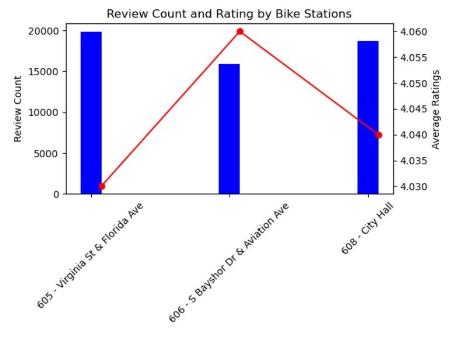

# Final-Project-Statistical-Modelling-with-Python

## Project/Goals
1. Pull data from 3 API’s

2. Transform data
 
3. EDA
 
4. Visualization
 
5. Statistical Modelling

## Process
Step 1: CityBikes API
•	Grabbed live data from CityBikes API
•	Generated a list of ebike stations in Miami Beach, Florida, USA using CityBikes network id “decobike-miami-beach”
•	Parsed results into a dataframe and maintained the following columns – City, CityLatLon, Bike Company, Bike Stations, BikeStationsLatLon, freebikes, empty slots

Step 2: FourSquare API 
•	Saved my id ,secret and api_key in a notepad and read it into the notebook 
•	Pulled the POI in the CITY using the LATLON from the city bikes API using a radius of 1000m (which may not be necessary in this case) and limited the records to 50.
•	I also was not specific with the POI and got info for bars, pharmacy, parks, café , sports centre, et.c

Step 3: YELP API
•	For Yelp, I used 3 sample size of bike stations and I pulled the POI reading the pickle file from the city bikes API notebook using a radius of 1000m and limited the records to 20 for each stations making 60 records.
•	Again, I also was not specific with the POI and got info for bars, pharmacy, parks, café , sports centre, et.c so I split the categories attributes into 3 different categories 
•	Saved the file for each stations in a pickle for reference in the joining data notebook. That was where I did my cleaning as well.

## Results

## Challenges 
(discuss challenges you faced in the project)

## Future Goals
(what would you do if you had more time?)
